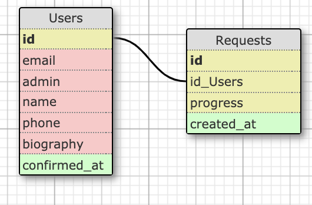

Rails app generated with Florent BRAURE's template.

 - ActiceAdmin
 - Recaptacha
 - Postmark
 - Tasks for Heroku+Scheduler
 - Cookies

  

1. Sign-Up is accessible from root_path
2. Validations are
  email : URI::MailTo::EMAIL_REGEXP
  name : presence true, uniqueness: true
  phone: format 10 numbers
  biography: presence: true, 20 to 500 chars
3. Email must be validated with Devise::Confirmable
4. Heroku scheduler ask for the re validation every 3 months. Unless status is expired
5. User.XXX.accept! and User.XXX.active_request.accept! will accept a request (create e new one with status: accepted)
6. Request.stats display the requests stats

TODO : AASM, Tests
